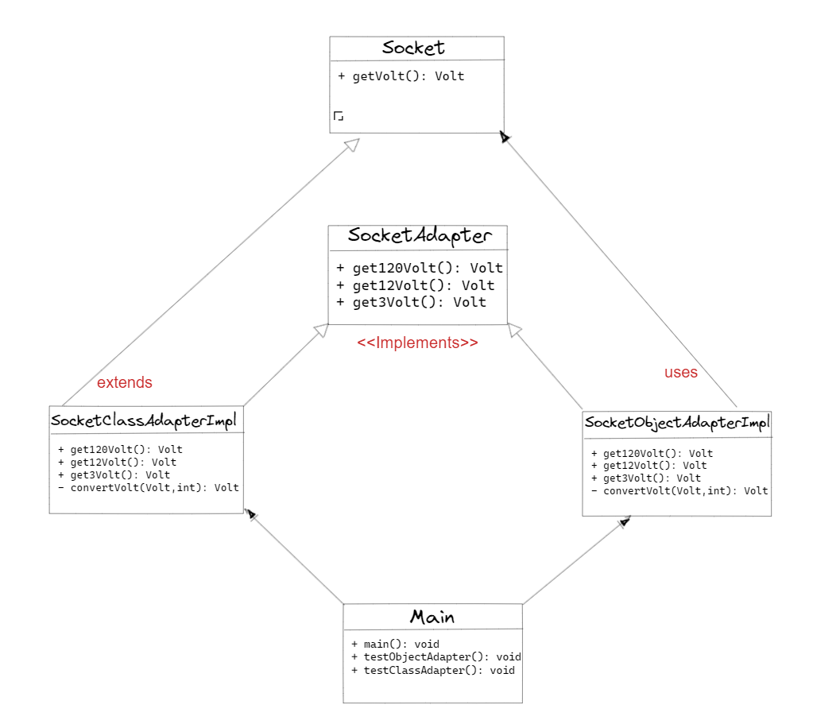

## :heavy_check_mark: Adapter Method Örneği

<strong> Adaptör tasarım modelinin gerçek hayattaki en iyi örneklerinden biri mobil şarj cihazıdır. Mobil bataryanın şarj olması için 3 volta ihtiyacı vardır ancak normal priz ya 120V (ABD) ya da 240V (Hindistan) üretir. Dolayısıyla mobil şarj cihazı, mobil şarj soketi ile duvar prizi arasında bir adaptör olarak çalışır. Bu örnekte adaptör tasarım modelini kullanarak çoklu adaptör uygulamaya çalışacağız.</strong>