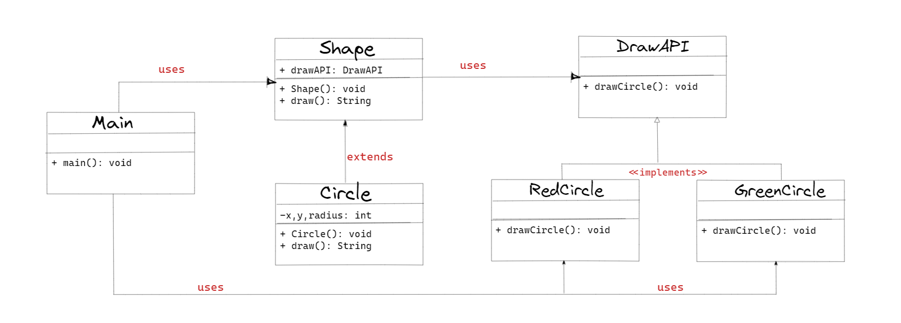

## :diammond_shape_with_a_dot_inside: Bridge Pattern

**Bridge tasarım deseni, nesneler arasındaki soyutlamayı ve gerçeklemeyi ayrı tutarak bir sistem tasarlama yaklaşımıdır. Bu desen, soyutlamayı oluşturan nesnelerin işlevselliğini ayrı bir sınıfta belirleyerek, gerçekleme detaylarının başka bir sınıfta yer almasını sağlar. Bu sayede, farklı soyutlama sınıfları için aynı gerçekleme sınıfı kullanılabilir ve değişiklikler bir sınıfın diğerini etkilemeden yapılabilir.**

**İki farklı sınıf hiyerarşisini birleştirmek için kullanılan bir yapısal tasarım desenidir. Bu desen, sınıflar arasındaki kopukluğu azaltmak için kullanılır. Bridge Deseni, sınıfların birbirleriyle bağımlılığını azaltır ve bu sayede daha esnek bir yapı oluşturulmasını sağlar.**

**Örneğin, bir şekil sınıfı ve bir renk sınıfı düşünelim. Bridge tasarım deseni kullanılarak, her şekil sınıfı farklı bir renk sınıfı ile eşleştirilebilir ve değiştirilebilir. Bu sayede, şekil ve renk sınıfları birbirinden bağımsız hale gelir ve bir sınıfın değişikliği diğerini etkilemez.**

