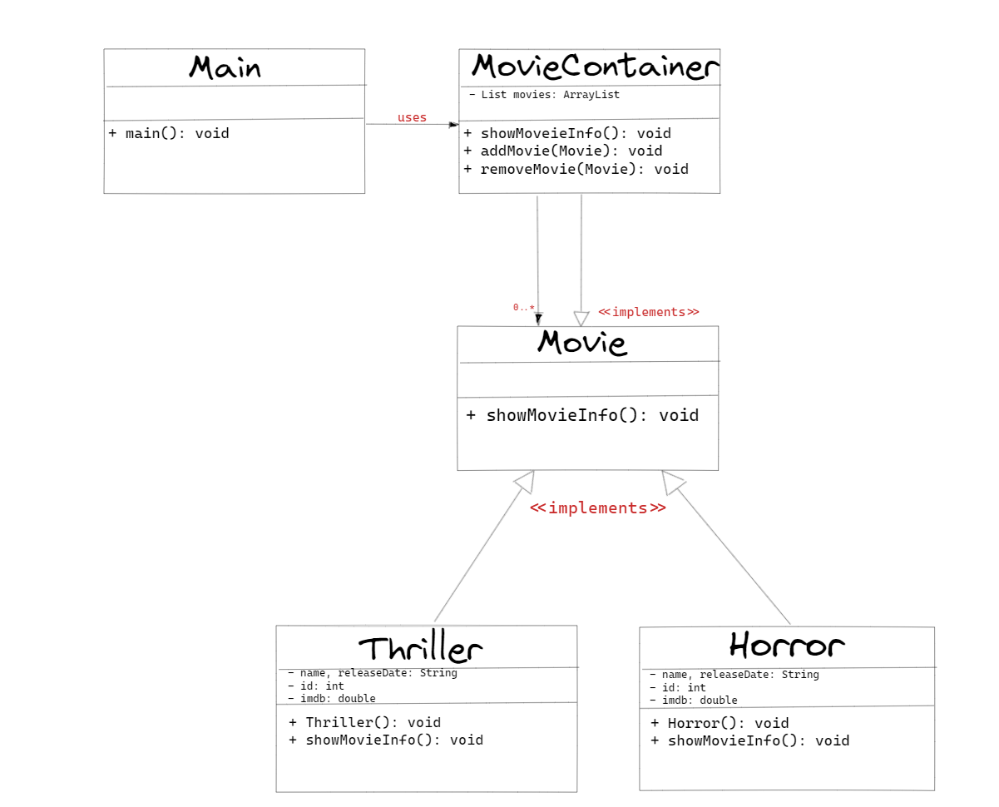

## :diamond_shape_with_a_dot_inside: Composite Pattern

**Composite pattern, kendi içlerinde birbirlerinden farklı olan bir grup nesnenin sanki tek bir bütün nesneymiş gibi kullanılmasını sağlamaktadır. Böylece farklı nesneleri bir ağaç yapısında birleştirip genel anlamda parça bütün ilişkisini yeniden düzenleyip şekillendirmektedir.**

**Composite, bir ağaç yapısını temsil eden nesneler için kullanılır. Bu tasarım deseni, tek tek nesnelerin ve nesnelerin ağaç yapılarının birleştirilmesini kolaylaştırır.**

**Composite Tasarım Deseni, hiyerarşik bir nesne yapısı oluşturmak için kullanılır. Bu yapının altındaki nesneler birbirinin yerine kullanılabilir ve bir arada kullanılabilir. Örneğin, bir dosya sistemi gibi hiyerarşik bir yapı, Composite Tasarım Deseni ile modellenebilir.**

**Aynı zamanda "bölüm-bütün" ilişkisini de modelleyebilir. Bu tasarım deseni, birden çok nesnenin birleştirilmesine olanak tanır. Her nesne, kendi kendine bir nesne olabilirken, aynı zamanda başka nesneleri de içerebilir. Bu sayede, büyük nesnelerin küçük nesnelerin birleşiminden oluşan bir hiyerarşi içinde oluşturulması mümkün hale gelir.**

**Composite Tasarım Deseni'nin avantajları şunlardır:**

- **Hiyerarşik nesne yapısı oluşturmayı kolaylaştırır.**
- **Nesnelerin birleştirilmesine olanak tanır.**
- **Genişletilebilir bir yapı sunar.**
- **Kodun yeniden kullanılmasını kolaylaştırır.**

