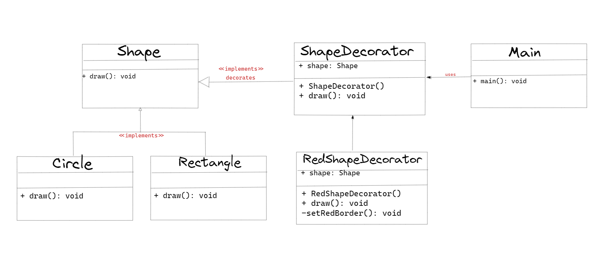

## :diamond_shape_with_a_dot_inside: Decorator Pattern

**Decorator tasarım deseni, nesneler arasında çalışma zamanında özellik eklemek veya değiştirmek için kullanılan bir tasarım desenidir. Bu desen, nesne yönelimli programlamada bir sınıfın davranışlarını değiştirmek için alternatif bir yol sunar ve sınıfın yapısını değiştirmeden yeni davranışlar eklemek veya mevcut davranışları değiştirmek için kullanılır.**

**Decorator tasarım deseni, mevcut bir sınıfın işlevselliğini etkilemeden, yeni özelliklerin eklenmesine olanak sağlar. Bu tasarım deseninde, bir nesneyi sarmalayan birçok dekoratör sınıfı bulunur ve her biri sarmalanan nesneye davranışlar ekler. Bu sayede, nesne işlevselliği değiştirilmeden yeni davranışlar eklenmiş olur.**

**Decorator Tasarım Deseni, bir nesneye ek işlevselliği eklemek için bir arayüz sağlar. Bu arayüz, nesnenin özelliklerini değiştirmeden, ek işlevselliği sağlar. Bu sayede, nesnenin davranışı dinamik olarak değiştirilebilir.**

**Bu tasarım deseni, nesnelere sınırlı bir şekilde işlevsellik eklemek için kullanılır. Örneğin, bir web sayfasındaki metin kutusuna bir "örnek metin" ekleme işlevselliği eklemek istiyorsanız, bunu Decorator Tasarım Deseni ile yapabilirsiniz.**

**Decorator Tasarım Deseni, açıkça tanımlanmış bir arayüzü kullanır ve her dekoratör sınıfı bu arayüzü uygular. Bu sayede, nesnelerin dekoratörlerinin birbirleriyle değiştirilebilir olması sağlanır.**

**Özetle, Decorator tasarım deseni, nesneler arasında çalışma zamanında özellik eklemek veya değiştirmek için kullanılan bir tasarım desenidir. Bu desen, açık-kapalı prensibi uygun bir şekilde uygular ve bir sınıfın işlevselliğini etkilemeden yeni özelliklerin eklenmesine olanak sağlar.**

**Decorator Tasarım Deseni'nin avantajları şunlardır:**

- **Nesnelere dinamik olarak yeni işlevsellik ekleme olanağı sağlar.**
- **Nesne davranışlarını değiştirirken, nesnenin özelliklerini korur.**
- **Daha esnek bir tasarım sağlar.**
- **Kodun yeniden kullanılmasını kolaylaştırır.**

