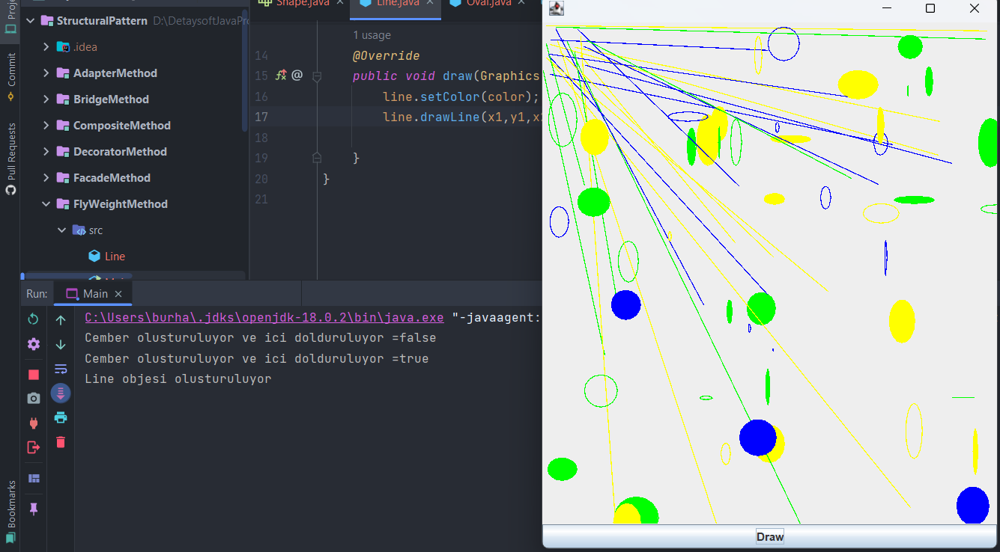

## :diamond_shape_with_a_dot_inside: FlyWeight Pattern

**Flyweight tasarım deseni Yapısal bir tasarım desenidir. Flyweight tasarım deseni, bir sınıfa ait çok sayıda nesne oluşturmamız gerektiğinde kullanılır. Her nesne, mobil cihazlar veya gömülü sistemler gibi düşük bellekli cihazlar için çok önemli olabilecek bellek alanı tükettiğinden, nesneleri paylaşarak bellek üzerindeki yükü azaltmak için flyweight tasarım deseni uygulanabilir. Flyweight tasarım desenini uygulamadan önce aşağıdaki faktörleri göz önünde bulundurmamız gerekir:**

- **Uygulama tarafından oluşturulacak Nesne sayısı çok fazla olmalıdır.**
- **Nesne oluşturma bellek üzerinde ağır bir yüktür ve zaman alıcı da olabilir.**
- **Nesne özellikleri içsel ve dışsal özellikler olarak ikiye ayrılabilir, bir Nesnenin dışsal özellikleri istemci program tarafından tanımlanmalıdır.**

**Flyweight modelini uygulamak için Object özelliğini intrinsic (içsel)** **ve extrinsic (dışsal)** **özelliklerine ayırmamız gerekir. İçsel özellikler Nesneyi benzersiz kılarken, dışsal özellikler istemci kodu tarafından ayarlanır ve farklı işlemler gerçekleştirmek için kullanılır. Örneğin, bir Object Circle renk ve genişlik gibi dışsal özelliklere sahip olabilir. Flyweight modelini uygulamak için, paylaşılan nesneleri döndüren bir Flyweight fabrikası oluşturmamız gerekir. Örneğimiz için, diyelim ki çizgiler ve ovaller içeren bir çizim oluşturmamız gerekiyor. Bu yüzden bir Shape arayüzüne ve onun Line ve Oval olarak somut uygulamalarına sahip olacağız. Oval sınıfı, Oval'in verilen renkle doldurulup doldurulmayacağını belirlemek için içsel özelliğe sahip olurken, Line herhangi bir içsel özelliğe sahip olmayacaktır.**

🎯 **Kod çıktısına bakacak olursak**

