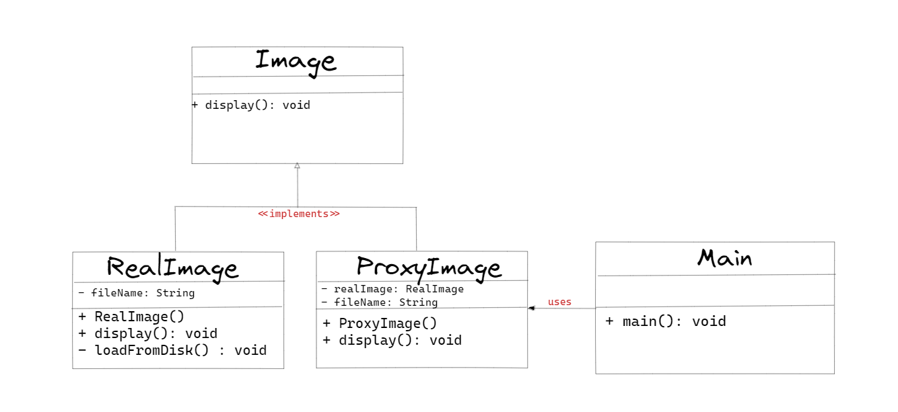

## :diamond_shape_with_a_dot_inside: Proxy Pattern

**Proxy, adından da anlaşılacağı üzere vekillik yapar yani bir nesnenin başka bir nesneyi temsil etmesine olanak tanıyan bir tasarım desenidir. Bu desen, gerçek nesneye doğrudan erişmek yerine, bir ara yüz aracılığıyla nesneye erişen bir ara nesne kullanarak çalışır. Bu sayede, gerçek nesneyi koruyabilir, güvenliği sağlayabilir, önbelleğe alabilir veya uzaktan erişimi sağlayabilirsiniz.**

**Örneğin, bir web sayfası yüklerken, sayfanın resimlerini yüklemek için bir proxy kullanılabilir. Proxy, web sayfasının resimlerine doğrudan erişmek yerine, resimleri önbelleğe alarak yüklemeyi hızlandırabilir. Ayrıca, proxy, web sayfasının kaynağına olan talebi azaltarak sunucunun yükünü de hafifletebilir.**

**Başka bir örnek olarak, bir veritabanı uygulaması için bir proxy kullanılabilir. Veritabanı bağlantısının açık kalması yerine, bir proxy nesnesi kullanarak veritabanı bağlantısının açılması ve kapatılması kontrol edilebilir. Bu, veritabanı bağlantılarının daha verimli kullanılmasına ve gereksiz yere açık kalmamasına yardımcı olabilir.**

**Java'da Spring Framework, AOP (Aspect Oriented Programming) kullanarak Proxy tasarım desenini kullanır. AOP, Spring'te, özellikle günlük tutma, hata ayıklama, güvenlik denetimi gibi görevleri gerçekleştiren nesnelerin yaratılmasında kullanılır. Bu nesneler, belirli bir ara yüz veya işlevi gerçekleştirirken, arka planda bir proxy nesnesi kullanarak özelliklerini genişletebilir veya değiştirebilirler.**

